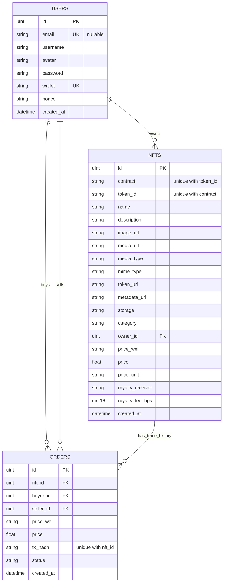

# NFT 项目数据库 E-R 图

说明：本图依据项目当前数据库模型生成，核心实体来自 `backend/internal/model/models.go`，包含 `users`、`nfts`、`orders` 三张表。

## 关系说明

1. `USERS` 与 `NFTS` 是一对多关系。
   `nfts.owner_id` 指向 `users.id`，表示一个用户可以拥有多个 NFT。

2. `USERS` 与 `ORDERS` 有两组一对多关系。
   `orders.buyer_id` 指向 `users.id`，表示用户作为买家参与的订单。
   `orders.seller_id` 指向 `users.id`，表示用户作为卖家参与的订单。

3. `NFTS` 与 `ORDERS` 是一对多关系。
   `orders.nft_id` 指向 `nfts.id`，表示一个 NFT 在历史上可以对应多笔成交订单。

## 约束说明

1. `users.wallet` 为唯一索引。
2. `users.email` 为唯一索引，但允许为空。
3. `nfts.contract + nfts.token_id` 构成联合唯一索引，用于唯一标识某个链上 NFT。
4. `orders.nft_id + orders.tx_hash` 构成联合唯一索引，用于避免同一 NFT 的同一链上交易重复入库。
