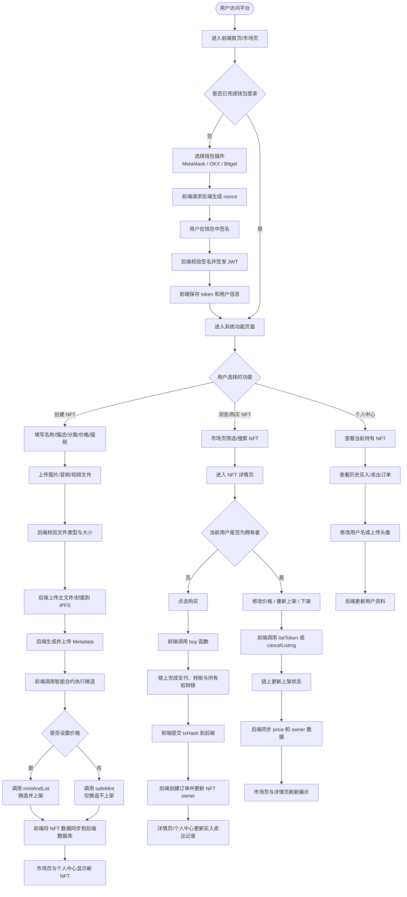
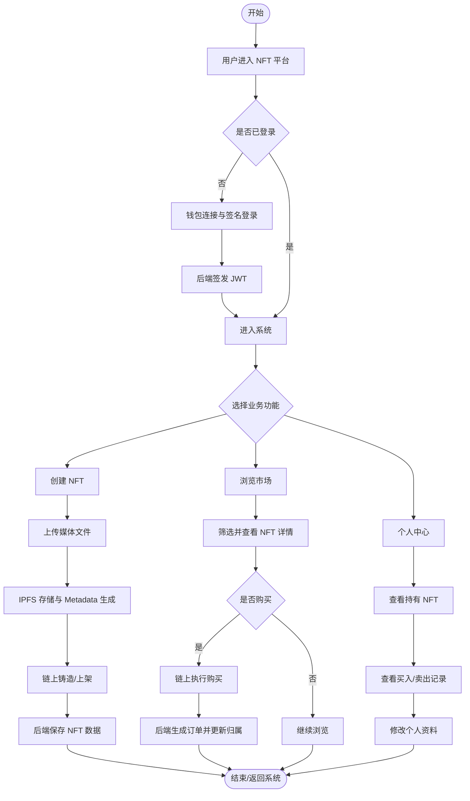

# NFT 项目系统流程图

说明：以下流程图依据 `D:\AStudy\NFT` 当前项目实现绘制，适合作为论文中的“系统总体流程图”或“系统业务流程图”。

## 1. 系统总体流程图

## 2. 精简版论文插图流程图

如果你想放到论文里，这个精简版更适合直接当“图 C-1 系统总体流程图”使用。

## 3. 使用建议

1. 如果你要放论文正文，建议优先使用“精简版论文插图流程图”。
2. 如果你要答辩讲解系统闭环，建议使用“系统总体流程图”。
3. 如果你需要，我还可以继续给你画：
   - 钱包登录流程图
   - NFT 创建流程图
   - NFT 购买流程图
   - 后端处理流程图
